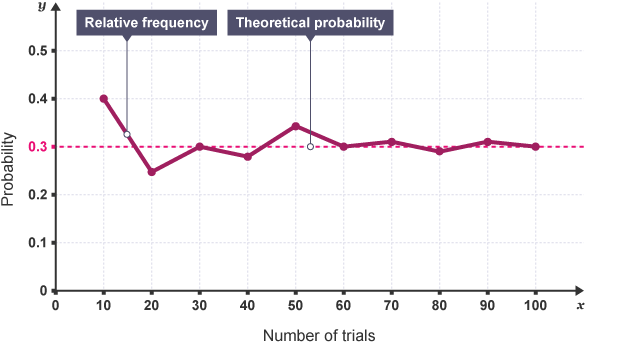

# Chapter 1. Probability Theory
## 1.2 Definition of Probability
Here, we will examine **the meaning of probability for events** expressed as subsets of the sample space $S$.

### Canonical definitions of probability (historical order)
#### 1. Classical (Laplace) definition — equally likely outcomes  
- **Definition**

$$
P(A) = \frac{\text{number of favorable outcomes}}{\text{number of total outcomes}}
$$
- **Examples**
    - $S=\\{HH, HT, TH, TT\\}$. If we assume the coin is fair, then the 4 elements in the sample space each occur with equal probability,
    - $P(A)=P(HT,TH)=2/4=1/2$
- **Strengths** Simple, Intuitive
- **Limitations**: Requires *equally likely* outcomes, Not applicable to continuous sample spaces
- **Historical role:** This is where probability *starts*, but it is **not foundational**.
#### 2. (19th century) Relative frequency (Frequentist) definition (the most widely accepted interpretation of probability)
- When we perform an experiment once, either event $A$ occurs within the sample space $S$, or its complement $A^{c}$ occurs (that is, either $A$ happens or it doesn’t—one or the other). Now, suppose we repeat this experiment independently under identical conditions $n$ times, and let $m$ be the number of times that event $A$ occurs. The value of $m/n$ is not deterministic—it changes from experiment to experiment—but as the number of trials $n$ increases, it stabilizes. Therefore, under the assumption that the experiment can be repeated infinitely many times, we define the probability $P(A)$ of event $A$ as the limiting value of the relative frequency $m/n$ as $n$ becomes large.
- **Definition**
    - Probability is defined as the long-run relative frequency of an event:

$$
P(A) = \lim_{n \to \infty} \frac{N_n(A)}{n}
$$

- where:
    - $n$ = number of trials  
    - $N_n(A)$ = number of times event $A$ occurs

- **Examples**

    - In the case of repeated independent tosses of a coin, the relative frequency of heads occurring is not a fixed constant: $m/n$ can be different in each new experiment. However, if as $n$ grows large, the relative frequency $m/n$ converges to $1/2$, then the probability of event $A$ (getting heads in a single toss) is defined as $P(A) = 1/2$ according to the relative frequency definition.
    - **Strengths** Empirical, Objective, Directly linked to observation
    - **Limitations**: Requires infinite trials (idealization), Cannot define probability of single events
    - **Historical role:** This definition dominates **classical statistics and empirical sciences**.

#### 3. (18–20th century, formalized later) Subjective (Bayesian) probability  
- **Definition** Probability is a degree of belief held by a rational agent, given information:

$$
P(A \mid I)
$$
- **Interpretation**: Probability depends on information, Beliefs are updated via Bayes’ theorem
- **Examples** Probability that it will rain tomorrow, given current weather data.
- **Strengths** Can handle single events, Incorporates prior knowledge, Provides a coherent update rule
- **Limitations** Subjectivity of priors, Requires rationality assumptions
- **Historical role** Forms the basis of **modern Bayesian statistics, ML, and decision-making**.

#### 4. (1933 — modern foundation) Axiomatic (Kolmogorov) definition  
- The Russian mathematician Kolmogorov sought to define probability axiomatically, and showed that the following axioms are necessary and sufficient conditions for a function to be a probability.
- **Definition** Probability is a measure $P$ defined on a measurable space $(\Omega, \mathcal{F})$
satisfying:

1. $P(A) \ge 0$ for all $A \in \mathcal{F}$
2. $P(\Omega) = 1$
3. For disjoint events $A_i$:

$$
P\left(\bigcup_i A_i\right) = \sum_i P(A_i)
$$
- **Strengths** Fully rigorous, Works for discrete and continuous spaces, Separates mathematics from interpretation
- **Limitations** Abstract, Does not explain *what probability means*, only how it behaves
- **Historical role** This is the **modern mathematical foundation** of probability theory.
- In the axiomatic approach, probability is defined as a function on the sample space that satisfies the three axioms above. No matter which method is used to define probability—whether the classical, frequentist (relative frequency), or subjective (Bayesian) approach—these axioms must be satisfied. Based on this axiomatic definition, probability theory has made great progress and is built upon this foundation. The material that follows will also be grounded in this axiomatic definition of probability. Some basic properties of probability derived from the axioms are given in the following propositions.

#### Proposition (Basic properties of probability)

Let $(\Omega, \mathcal{F}, P)$ be a probability space.

- **Probability of the empty set** $P(\varnothing) = 0$
- **Complement rule** For any event $A \subset \Omega$, $P(A^c) = 1 - P(A)$
- **Monotonicity** If $A \subset B$, then $P(A) \le P(B)$
- **Inclusion–exclusion (two events)** For any events $A$ and $B$, $P(A \cup B) = P(A) + P(B) - P(A \cap B)$

These are elementary properties (immediate consequences) of Kolmogorov’s axioms.
